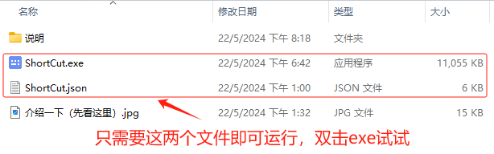
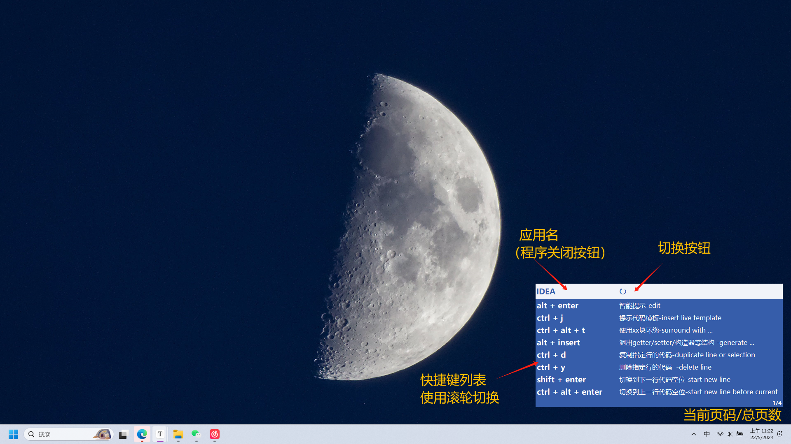
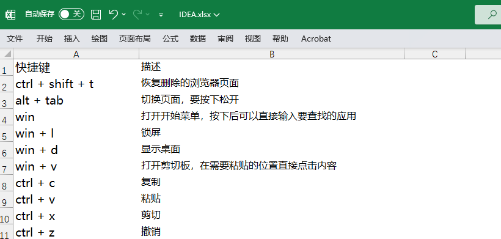

#### 快捷键查看应用

- **使用说明**





- [x] `ctrl + \` 弹出或者隐藏应用

- [x] 鼠标悬浮中心区域后使用滚轮上下滚动切换当前应用的快捷键列表

- [x] 右上角区域进行软件快捷键列表切换

- [x] **鼠标左键按住中心区域实现拖动效果** 
- [x] 点击左上角软件图标，应用退出（查看则需要再次启动应用）

- **软件下载** （将这两个文件放在同一个文件夹下即可，双击exe运行）

1. `ShortCut.exe` (用于打开存放在下面的json文件中的数据) 


2. `ShortCut.json` (数据来源，自定义) 


- **ShortCut.json文件定义** （手动添加方式或者Excel生成json）

1. 手动添加方式（适合少量的改动）

```json
{
  "IDEA": [
    {
        "快捷键": "ctrl + f",
        "描述": "查找指定结构"
    },
    {
        "快捷键": "ctrl + shift + f",
        "描述": "全项目搜索文本-find in path ... "
    }
  ],
  "Common" : [
    {
      "快捷键": "ctrl + shift + t",
      "描述": "恢复删除的浏览器页面"
    },
    {
        "快捷键": "alt + tab",
        "描述": "切换页面，要按下松开"
    }
  ],
  "Typora": [
    {
        "快捷键": "ctrl + shift + i",
        "描述": "图片引用"
    },
    {
        "快捷键": "ctrl + k",
        "描述": "超链接"
    }
  ]
}
```

IDEA、Common和Typora是三个应用，里面有各自对应的快捷键，如果需要添加可以手动复制一对大括号内容后修改右侧的双引号内容

其中"快捷键"和"描述"两个key不能修改，这对应了exe文件中的key

2.Excel生成json（适合有大量的快捷键需要添加，需要使用python，并手动进行少量修改）

- Excel文件生成



新建一个Excel文件添加内容并保存，注意字符不要太长（窗口大小固定可能展示不全）。同理**快捷键**和**描述**两个字段固定位置且不能修改

- 执行python文件

```py
# 文件名：ExcelToJson.py
import pandas as pd
import json

# 两个路径自定义
ExcelPath = 'C:\\Users\\Lzy\\Desktop\\IDEA.xlsx'
JsonPath = 'IDEA_ShortCut.json'

# 读取 Excel 文件 openpyxl 需要pip安装一下
df = pd.read_excel(ExcelPath, engine='openpyxl')

# 将 DataFrame 转换为 JSON
json_data = df.to_json(orient='records', force_ascii=False)

# 格式化 JSON 数据
formatted_json_data = json.dumps(json.loads(json_data), indent=4, ensure_ascii=False)

# 将格式化后的 JSON 数据写入文件
with open(JsonPath, 'w', encoding='utf-8') as f:
    f.write(formatted_json_data)

```

会获得下面这个IDEA_ShortCut.json文件，之后对ShortCut.json进行适当修改，注意这个只需要里面方括号的内容

```json
[
    {
        "快捷键": "ctrl + shift + t",
        "描述": "恢复删除的浏览器页面"
    },
    {
        "快捷键": "alt + tab",
        "描述": "切换页面，要按下松开"
    },
    {
        "快捷键": "win",
        "描述": "打开开始菜单，按下后可以直接输入要查找的应用"
    },
    {
        "快捷键": "win + l",
        "描述": "锁屏"
    },
    {
        "快捷键": "win + d",
        "描述": "显示桌面"
    },
    {
        "快捷键": "win + v",
        "描述": "打开剪切板，在需要粘贴的位置直接点击内容"
    },
    {
        "快捷键": "ctrl + c",
        "描述": "复制"
    },
    {
        "快捷键": "ctrl + v",
        "描述": "粘贴"
    },
    {
        "快捷键": "ctrl + x",
        "描述": "剪切"
    },
    {
        "快捷键": "ctrl + z",
        "描述": "撤销"
    }
]
```