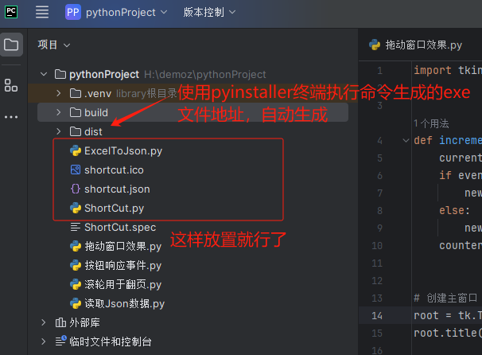

##### 相关python文件

- **介绍**

  1. ShortCut.py

     需要打包成exe文件，打包方式在下方

  2. ExcelToJson.py

     将Excel文件转为json文件，提供数据的

- **生成exe文件** 

​		控制台输入，参考ChatGPT和[打包错误 ](https://www.cnblogs.com/uoky/p/17916300.html) 

```python
# 如果发生包含病毒或潜在的垃圾文件，卸载pyinstaller
# pip uninstall pyinstaller
pip install pyinstaller==6.2.0
pip install keyboard
pyinstaller --onefile --windowed --icon="shortcut.ico" ShortCut.py
# 这里onefile是针对这一个py文件，不需要命令行窗口，设置图标
```

